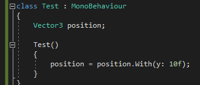

# Contents

## Extensions

#### Colors (Colors.cs)
Extends the Unity Color class to add extra color presets.

#### Vector3 (VectorHelper.cs)  
Adds a shortcut method to Vector3s which allows you to change it by only specifying 1 or more components.  
Example:  

## Shaders

#### Nothing
The Standard shader at 0% opacity still has draw calls even though you can't see it.  
This surface shader however literally renders nothing and does as few calculations as possible.  
Useful for hiding parts of a mesh via materials.  
Found in the **TehLemon/Nothing shader menu**.

## Static Utilities

#### Math functions (UtilHelper.cs)
A collection of static math helper functions. Check the comments for more details on each function.

