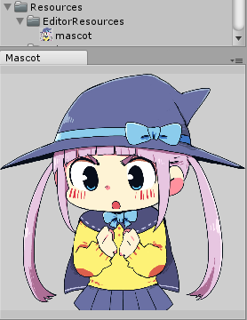
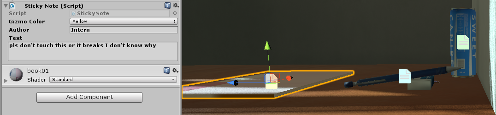
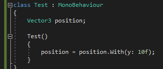

# Collection of Unity utilities

This is the folder I always copy into any new Unity project. I use these with Unity 5.6/2017.  

Any scripts found in the Editor folder must also be in an Editor folder in your project.  
Any extra instructions will listed in the comments at the top of the file or functions.  
Some of these may require the TehLemon namespaces.  
Some of these may require setting Unity to use .net 4.6/C# 6.0. Including your code editor if you use to modify any of these.

I make no promises over the quality or up-to-date-ness of the code.

# Contents

## Editor Tools

#### Color Space Converter (ConvertRGBToLinearEditor.cs)
Converts colors between the gamma and linear color space.  
Access from the **Tools** menu.  

#### Extra Hotkeys (EditorShortcutHotkeys.cs)
Hit **alt+D** in the Editor to deselect all gameobjects in the scene.  
Hit **F5** to Play and Stop the game.  
Hit **F8** to take a screenshot.  
* Change the save location in Unity's **Edit/Preferences/Melon Core**
* By default the location is " " which will save the image to the project's root folder.

#### Mascot Panel (MascotPanel.cs)
A panel for the Editor that displays an image.  
Access from the **Windows** menu.  
Name your image "mascot" and place it in the folder "**Assets/Editor Default Resources/**".  
Supports .jpg, .png and static .gif.  

#### Revert to Prefab (RevertAllPrefabs.cs)
Reverts all the selected gameobjects in the Editor back to their prefab state.
Found in the **Tools** menu.

#### Sticky Notes (StickyNote.cs and the Gizmos folder)  
In-Scene view sticky notes represented with gizmos. Useful for long-term or team projects.  
Just add the **TehLemon/StickyNote component** onto any gameobject.  
Add it onto an empty (child) gameoject if you want to move it around. Prefab included.  

## Extensions

#### Colors (Colors.cs)
Extends the Unity Color class to add extra color presets.

#### Vector3 (VectorHelper.cs)  
Adds a shortcut method to Vector3s which allows you to change it by only specifying 1 or more components.  
Example:  

#### Custom Behaviour (CustomBehaviour.cs)
Extends the Monobehaviour class to add additional functionality that I find myself needing often.  
I don't recommend you use this directly as it has some dependencies and I tend to completely rewrite it every project but it might be useful as a reference.  
Features:  
* Defer the Start function till after my GameManager has intiialized.  
Needed as the script order is not guarunteed when the game is played from the Editor.  
* Cache regularly accessed components. Only caches the first time its called. 

## Shaders

#### Nothing
The Standard shader at 0% opacity still has draw calls even though you can't see it.  
This surface shader however literally renders nothing and does as few calculations as possible.  
Useful for hiding parts of a mesh via materials.  
Found in the **TehLemon/Nothing shader menu**.

#### StandardPacked
A surface shader that aims to replicate the functionality of the Standard shader and can be found in the **TehLemon/StandardPacked** shader menu.  
Unity's Standard shader packs both the metallic and smoothness maps into 1 file.  
This shader packs 4 textures into 1 file to save texture samples and memory.

Red: Metallic  
Green: Ambient Occlusion  
Blue: Emission Mask  
Alpha: Smoothness  

StandardPackedExtra also includes the secondary detail maps and the height map.

I'd like to further improve the inspector GUI of the shader to include some of the conveniences of the Standard shader but this has no impact on its current functionality.

## Static Utilities

#### Math functions (UtilHelper.cs)
A collection of static math helper functions. Check the comments for more details on each function.

